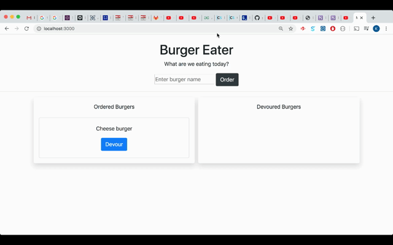

# Eat The Burger

This is a simple MVC-based web application that simulates ordering, eating and digesting burgers.

## Demo

Test the app -> [Demo]()

## GIF demonstration 

## Built With

* [Bootstrap](https://getbootstrap.com/) - Front-end framework
* [NodeJS](https://nodejs.org/en/) - Javascript runtime environment for this application
* [Express](https://expressjs.com/) - NodeJS framework for receiving and sending request with the front end
* [NPM](https://www.npmjs.com/) - A tool for dependency management 
* [Handlebars](https://handlebarsjs.com/) - Templating engine
* [jQuery](https://jquery.com/) - Javascript framework for DOM manipulation
* [MySQL](https://www.mysql.com/) - Database
* [Heroku](https://www.heroku.com/) - For application deployment

## Things I learned and reviewed

* Writing RESTful API
* Express Middleware and Routing (New)
* Templating with Handlebars (New)
* AJAX
* Model-View-Controller pattern (New)
* DOM Manipulation with jQuery 
* Querying MySQL Database

## Author

* [Khoi Nguyen](https://github.com/gh0stl0nely)
